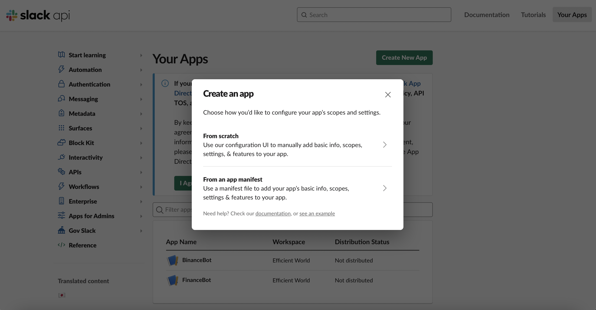
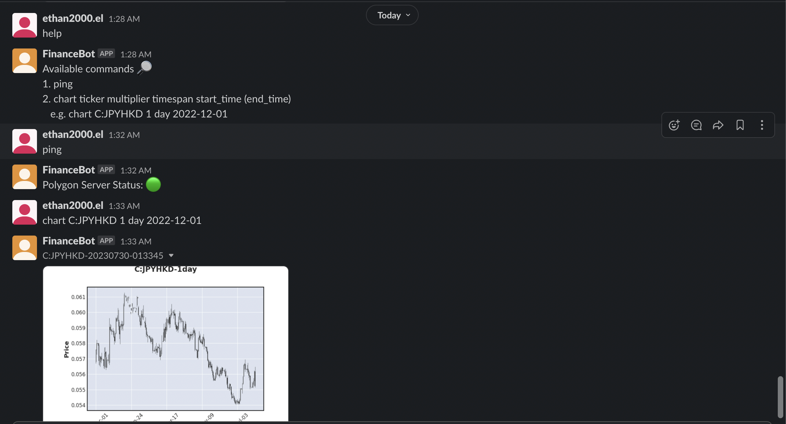

# Finance Bot

A simple bot utilising Polygon API, Slack API, and MQTT to monitor the financial market, including stocks, forex, options, and crypto

## 1. Prerequisites

Environments variables required for this repository, please create a `.env` file in root directory, it will be loaded into the docker containers by `docker-compose`.

`.env`:

```bash
POLYGON_API_KEY=
SLACK_BOT_TOKEN= #Bot User OAuth Token
SLACK_SOCKET_TOKEN=

# ----- BROKER CONFIG -----
BROKER_HOST=mosquitto
BROKER_PORT=1883
BROKER_USERNAME=
BROKER_PASSWORD=
```

### 1.1 Creating Polygon Account & API Key

[polygon.io](https://polygon.io)

- Creating an account is free of charge.
- There's a basic plan for API that is free of charge, which is sufficient for this project.

### 1.2 Creating Slack App

- Create a slack account
- [Create Slack App](https://api.slack.com/apps)
- Create an app "From an app manifest":
  
- Select the workspace you would like your bot to exists in.
- Copy the `app_manifest.yml` from this repository when entering app manifest.
- Click `Create`, and install the app to your workspace.

### 1.3 Tokens

To access the channel messages and send out messages from our program, we will need the tokens of the bot.

#### Socket Tokens

1. Click into the App you just created --> `Basic Information` --> Scroll and look for `App-Level Token`
2. Click on `Generate Token and Scope` --> give a token name --> click on `Add Scope` and select `connections:write` --> `Generate`.
3. Click on the newly created token --> Copy the token and paste it in `.env` under `SLACK_SOCKET_TOKEN`.

#### Bot User Token

1. Click on `OAth & Permission`.
2. Copy `Bot User OAuth Token` and paste it in `.env` under `SLACK_BOT_TOKEN`.

## 2. How to Start

### 2.1 Development mode

```bash
# Build docker image if Dockerfile changed
make mode=dev build

make mode=dev start

# Enter the containers to develop, e.g., slackbot container
docker exec -it financebot-slackbot bash

# Clean up
make mode=dev clean
```

### 2.2 Production mode

```bash
# Build docker image if Dockerfile changed
make mode=prod build

make mode=prod start

# Clean up
make mode=prod clean
```

## 3. Illustrations

Available commands:

1. `help`: replies a message on how to use it.
2. `ping`: replies the server status.
3. `chart`: plots candle sticks charts for the specified type of security and duration.
   - Example: `chart C:JPYHKD 1 day 2022-12-01`
   - This will return the candle sticks chart of `JPY/HKD` pair from `2022-12-01` to present.
   - Prefix for different types of equities.
     | **Types** | **Prefix** | **Examples** |
     |-----------|------------|----------------------|
     | Stocks | - | AAPL |
     | Options | O: | O:SPY251219C00650000 |
     | Indices | I: | I:NDX |
     | Forex | C: | C:EURUSD |
     | Crypto | X: | X:BTCUSD |


**Remarks**: all commands are case **insensitive**
